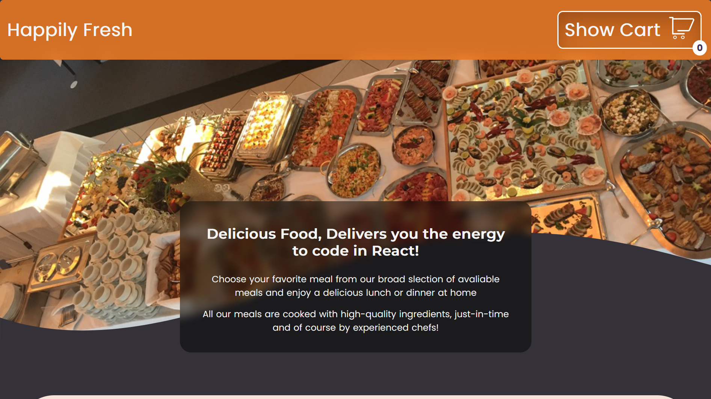
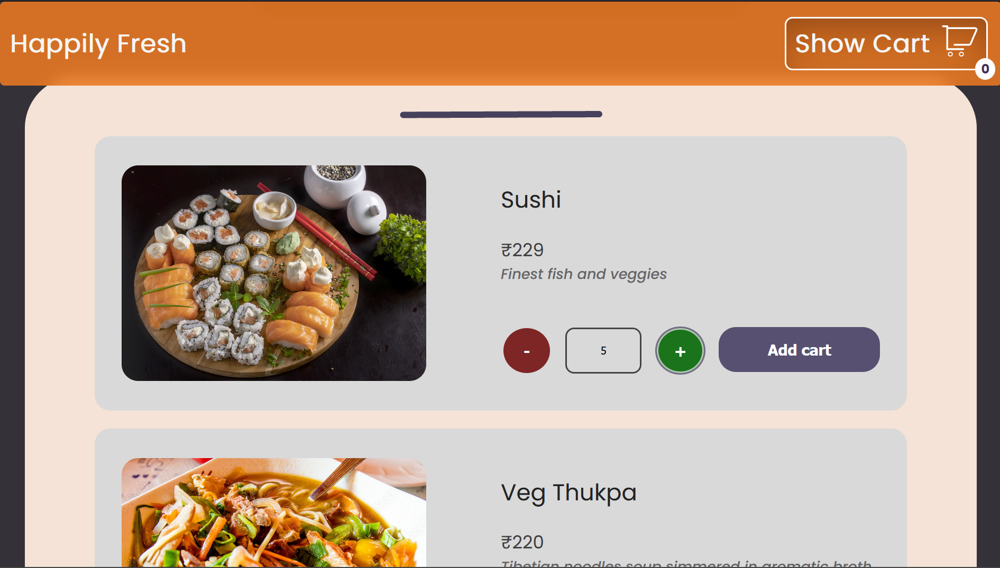
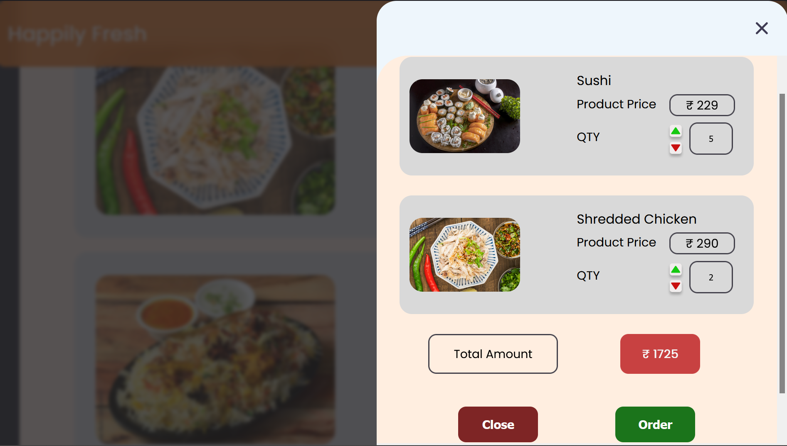
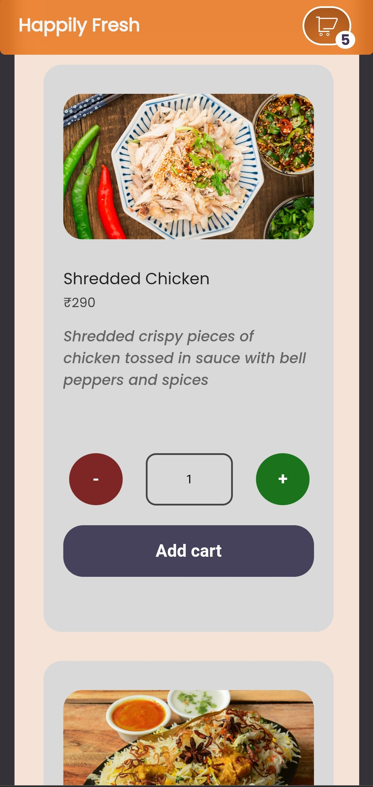
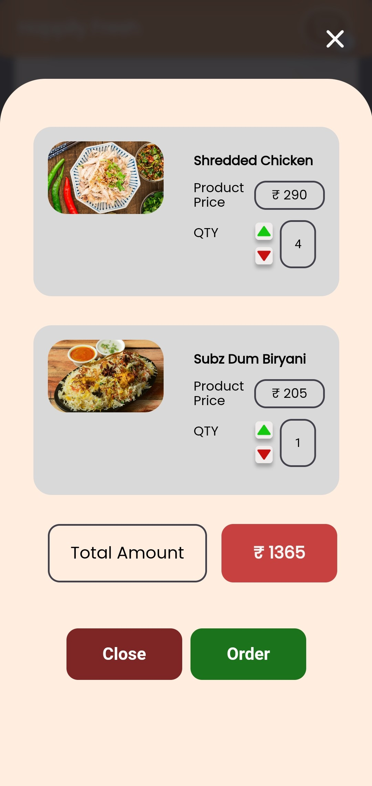

# Happily Fresh Webapp

- A straightforward React.Js responsive as well as functional webapp related to a food app that offers a list of foods that you can add to your cart.
- Languages used: **HTML, JSX, SASS, React.Js**.
- Here is the website link: **[Happily-Fresh-App](https://sadiqhasanrupani.github.io/food-meal-app/)**

# ScreenShots

## Midium Screen

---





## Phone Screen

---

<div align="center">
  
  
  
</div>

## How to run this app

- **Step-1:** Node must first be installed on your computer.
- **Step-2:** Clone my repo using this code
  ```
  git clone https://github.com/sadiqhasanrupani/food-meal-app.git
  ```
- **Step-3:** Render the "food-meal-app" file as desired.
  ```
  cd food-meal-app
  ```
- **Step-4:** Install the dependencies of this repository,
  ```
  npm install
  ```
- **Step-4:** Type "npm start" into your terminal.
  ```
  npm start
  ```
